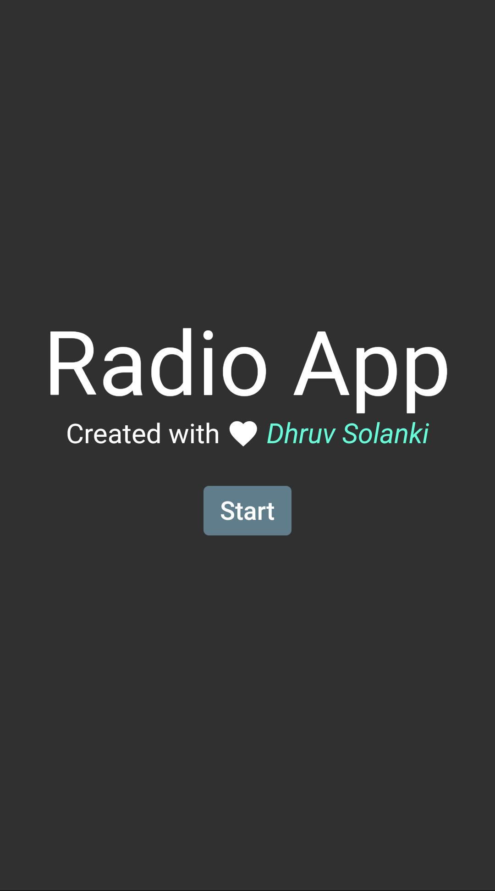
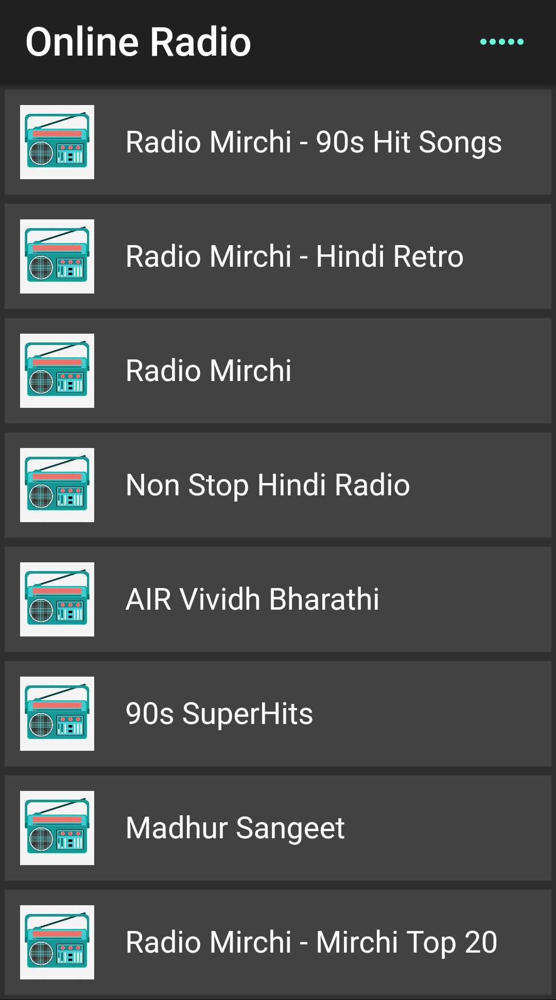
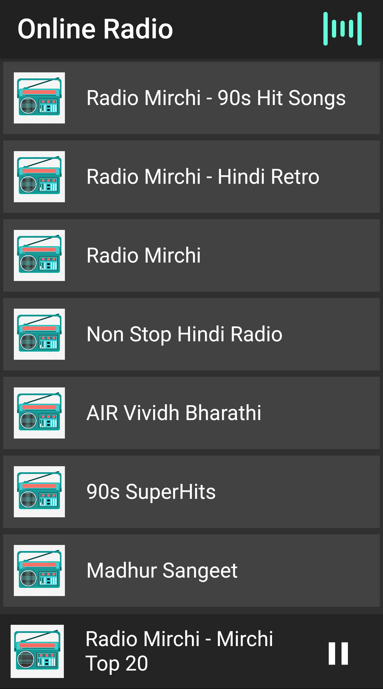
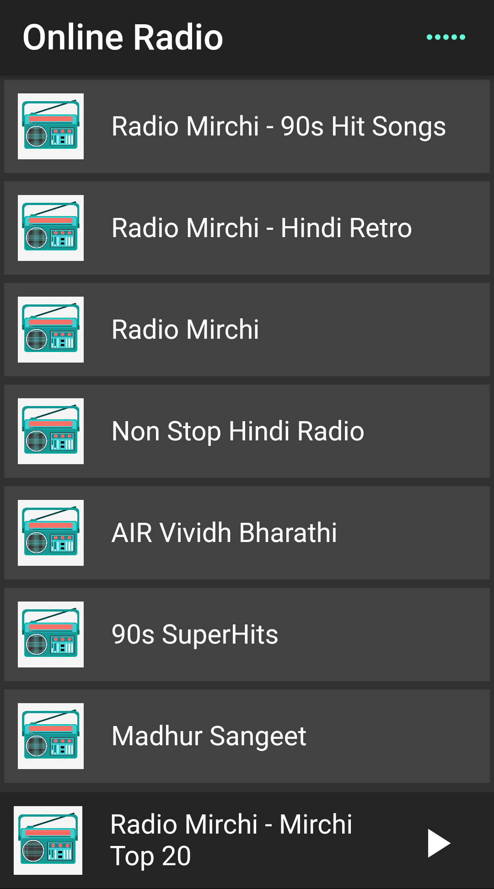

# Flutter Online Radio Application
A simple application that plays Online Radio.

## Android APK
* You can find the V1.0 APK in APK Versions folder.
* Download, Install and then enjoy.

## Pub Packages
* just_audio
* audio_session
* equatable
* loading_indicator
* cached_network_image
* dio
* dio_http_cache
* bloc
* flutter_bloc

## Version Changes
### Version 1.0 - Features
* Intro Screen with Developer name
* Home page - Shows list of Radio Stations
* On tap of any Radio station it plays that station
* After clicking at Bottom you will see Radio Player 
* Radio Player supports Play and Pause functionality
* Appbar contains name of app and Status of Radio
* Radio Status: Playing and Paused
* Even after phone locks it plays Radio Station
* Version 1.0 only supports now Indian Radio Stations
* The limit of Radio Stations that it displays is : 15
* Internet is must need otherwise app will not work
* There can be minor issues please report

## Screen Shots

| Intro Page | Home Page | Playing Radio | Paused Radio |
| -- | -- | -- | -- |
|  |  |  |  |
